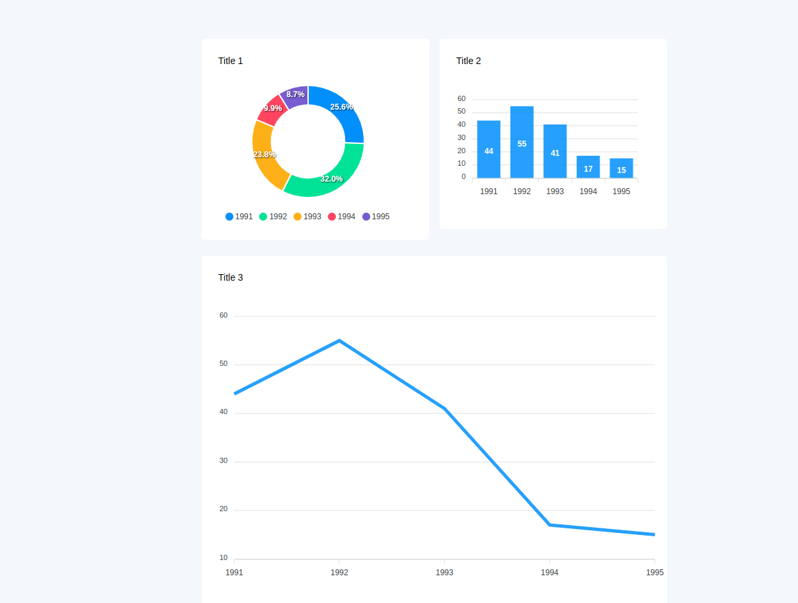

# Streamlit - ApexCharts ReactJS

A Streamlit simple component to display [ApexChart](https://apexcharts.com/).



## Install

```shell script
pip install streamlit_apexjs
```

## Usage
```python
from streamlit_apexjs import st_apexcharts
options = {
    "chart": {
        "toolbar": {
            "show": False
        }
    },

    "labels": [1991, 1992, 1993, 1994, 1995]
    ,
    "legend": {
        "show": True,
        "position": "bottom",
    }
}

series = [44, 55, 41, 17, 15]

st_apexcharts(options, series, 'donut', '600', 'title')
```

### st_apexcharts params


```
st_apexcharts(
    options: Dict
    series: List
    type: str
    width: str, number
    title: str
)
```

## Credit
Thank you for inspiration :) [andfanilo](https://github.com/andfanilo).